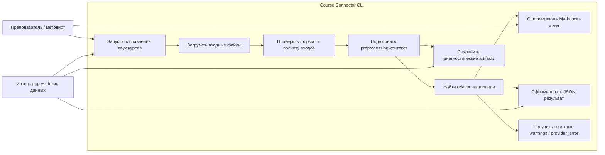
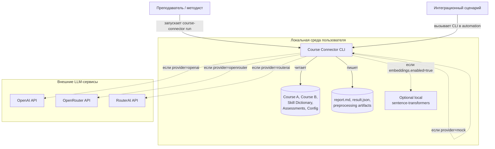
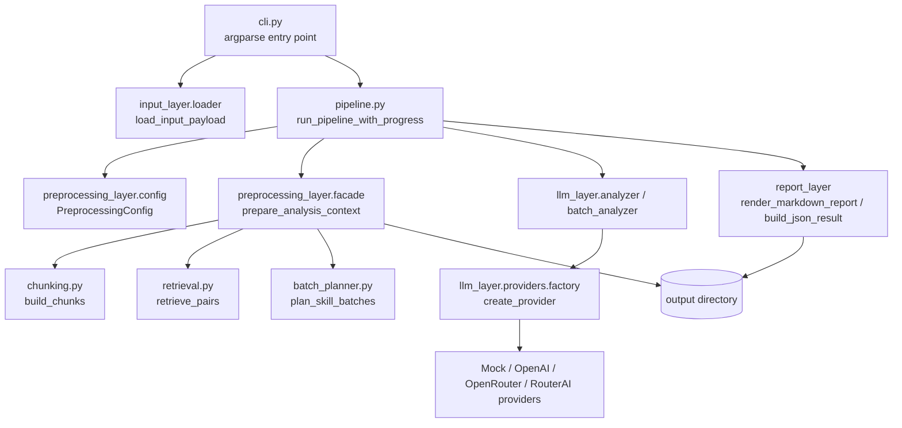
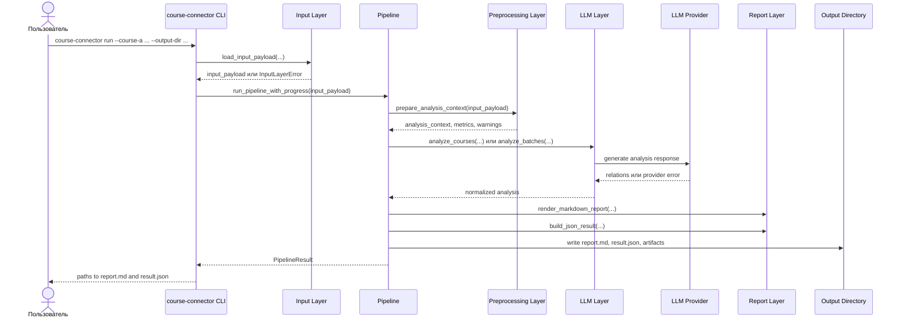
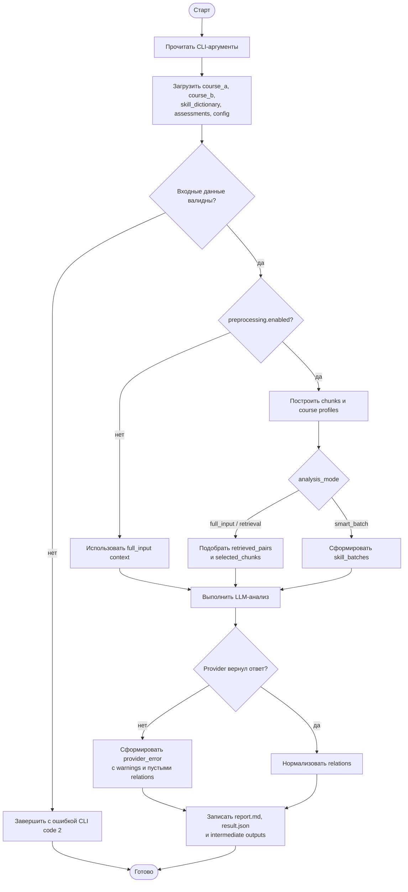
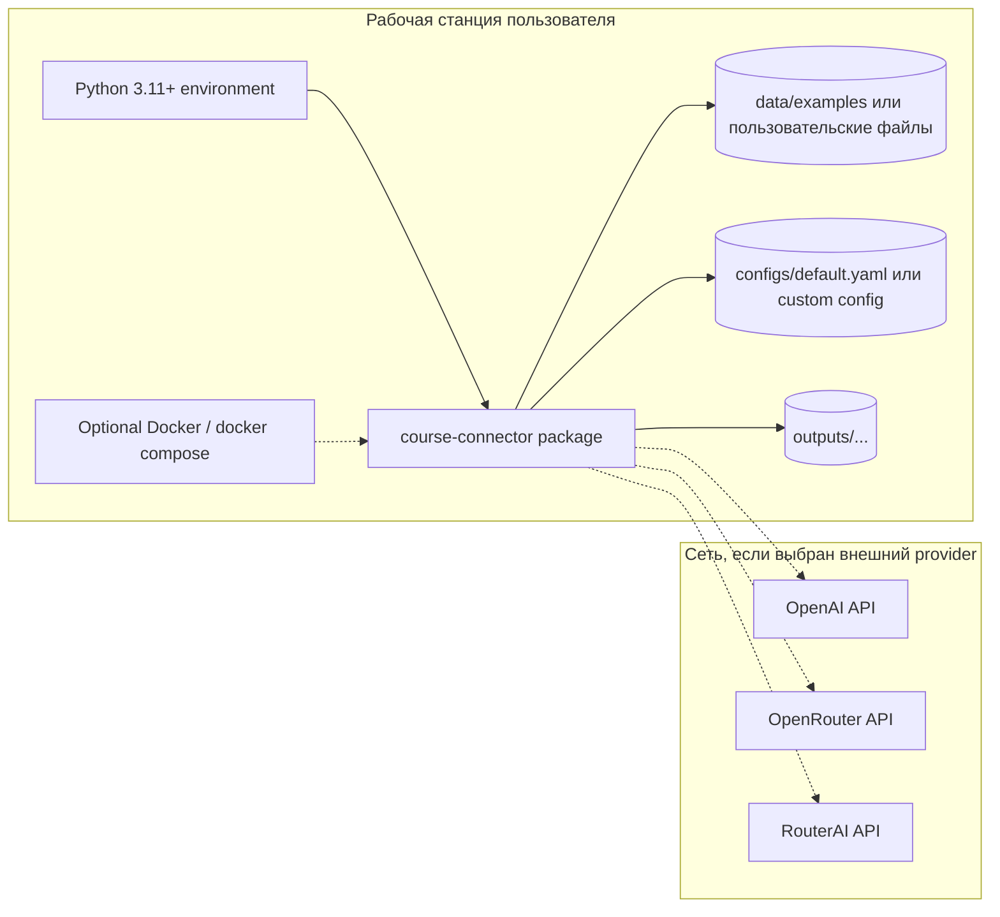

# UML-диаграммы Course Connector

Ниже приведены основные диаграммы проекта в формате Mermaid. Они описывают текущий MVP: локальный CLI-инструмент, который принимает файлы двух курсов, справочник навыков, материалы оценивания и конфигурацию, затем строит preprocessing-контекст, обращается к LLM provider и сохраняет отчетные файлы.

## Use Case

## Context Diagram

## Component Diagram

## Sequence Diagram: основной запуск CLI

## Activity Diagram: обработка данных

## Deployment Diagram

